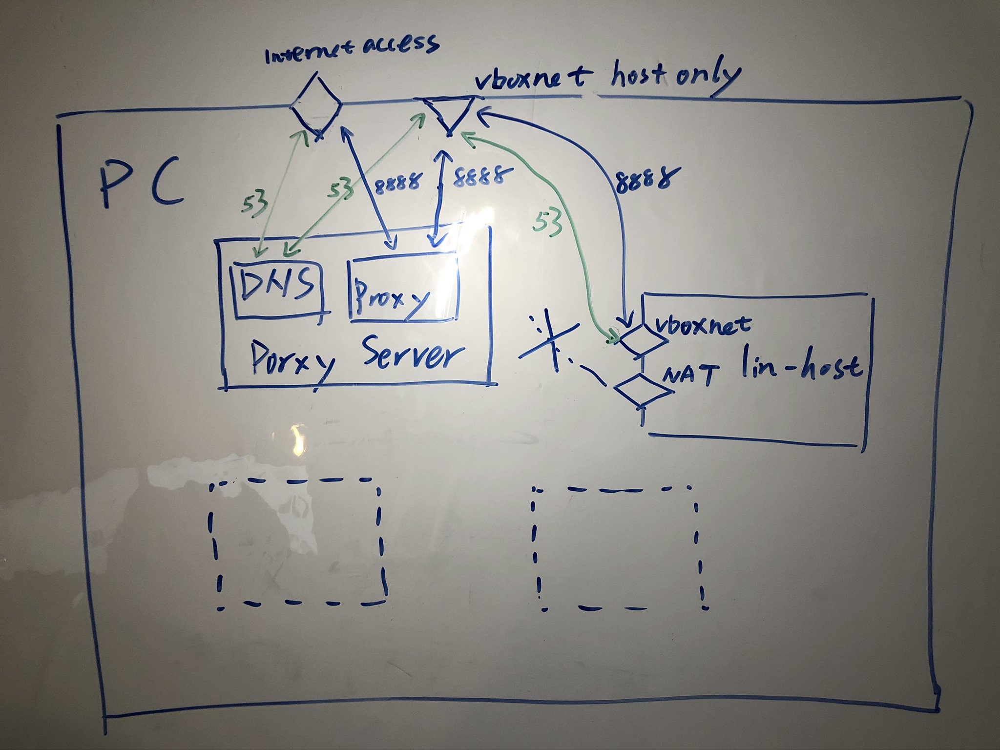

Ansible Proxy PRs Sandbox
=========

This project provide a sandbox environment to develop and test proxy related Ansible PRs.

It also provide utils to test Ansible modules and other related code.

Please note this repo is not to be used for creating PR. It is not an Ansible source code repo. It merely provides development and test environment.

It has a vagrant box(Proxy Server) providing DNS server and proxy server, and number of vagrant boxes using the proxy and DNS server.
Port 53 and 8888 on Proxy Server are forwarded to Host machine, so other vagrant boxes can access.
Other vagrant boxes (lin-hosts) needs to be disconnected from internet manually and only has access to the host.

Ansible are installed on all lin-hosts and necessary files are mounted into the vagrant box. The testing is carried out by running
ansible-playbook test.yml on the lin-host box targeting localhost.

The rather complicated architecture is designed to have minimal footprint 
on the PC, so no network setting are changed and no extra software need to be installed. 
The project is disposable and green. 

Requirements
------------

* Virtual Box
* Vagrant
* Linux: might also work in Microsoft Windows with few tweaks.
* 'sudo vagrant' permission is required to bring up the control box as it's mapping port 53 

Configuration
-------

before you can run the project, few settings needs to be tweaked based on your own PC.
I have some placeholder value which works on my PC, but not necessary works on any others. 

* .adot/vagrant/vagrant.yml
    * network_bridge: can be different on your PC. Use _ip a_ or _nmcli connection show_ to check yours.
    Alternatively, remove this attribute completely and fire up the vagrant box: _vagrant up proxy-server_. 
    Vagrant will give you the list to pick from. 
    * proxy_ip: this is your PC's IP on any of the vboxnet if you have more than one of them.
    To see the value, going to virtualbox GUI -> File -> Host Network Manager -> IPv4 Address.
    Or use command line _ip a_. 
    If you dont have any vboxnet, execute _relin.sh_. It should create it.
    * proxy_port: default value 8888 if you use the provided tinyproxy in Vagrant file. 
    I have this parameterised in case your 8888 is used by something else.
    * hosts/*/box: target environment where test can be carried out, use peru boxes if you prefer GUI desktop 

Usage
-------

1. make sure your port 53 is not used on PC _sudo netstat -tulpn | grep 53_
2. if it's used, it's most likely _resolved_, follow the steps in Vagrantfile provisioner "config nameserver"
below to free it up.
    * _sudo systemctl stop systemd-resolved_
    * _sudo sed -i 's/#DNSStubListener=yes/DNSStubListener=no/g' /etc/systemd/resolved.conf_
    * _sudo ln -sf /run/systemd/resolve/resolv.conf /etc/resolv.conf_
    * _sudo systemctl start systemd-resolved_
3. review and make configuration necessary changes in _.adot/vagrant/vagrant.yml_, make sure proxy port(default 8888) is not used on your PC
4. going to project folder, _cd .adot_
5. execute _./relin.sh_, this will destroy any existing lin-hosts and create fresh new ones
6. execute _./recon.sh_, this will create proxy-server. It requires sudo without password.
    Do a _sudo vagrant up proxy-server_ if your sudo needs password.
7. HACKY! going to each lin-host virtualbox created, _Machine_ -> _Settings_ -> _Network_
    Locating NAT Adapter, it's normally Adapter 1, click on _Advanced_, unselect _Cable Connected_ checkbox.
    This will disconnect the vagrant box from internet.
8. log into the vagrant box from GUI using username _vagrant_, password _vagrant_, _vagrant ssh_ won't work now
9. run _./test.sh_, output will be saved in /tmp/result, tasks without proxy should fail, tasks with proxy should success. 

License
-------

Copyright (c) 2020 Hangsu Ma

Simplified BSD License (https://opensource.org/licenses/BSD-2-Clause)

Author Information
------------------
Hangsu Ma

hangsu.ma@beag.biz
